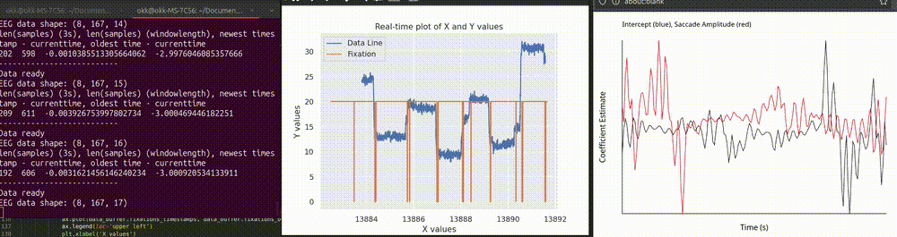
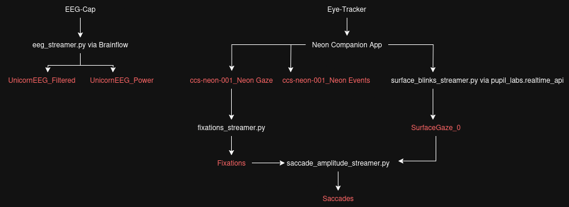

# Project Description
The project visualizes EEG+ET data in real-time on YouQuantified.com
The repository currently features 3 Demos:
- A kalaidoscopic image based on gaze position
- A julia fractal based on gaze position
- A real time Unfold.jl regression, epoched around saccades

# Inital Setup
The repository was tested on Ubuntu 23.10 and 24.04 on python 3.12.3. Steps for installing are as follows:

- Download appropriate [liblsl](https://github.com/sccn/liblsl/releases) deb file
- Install `libpugixml1v5` as a requirement for liblsl `sudo apt install libpugixml1v5`
- Install liblsl `sudo dpkg --install liblsl*.deb`
- Install pip `sudo apt install python3-pip`
- Install python virtual environments `sudo apt install python3.12-venv`
- Navigate to the root directory of the repository
- Create environment "eegenv" `python3 -m venv eegenv`
- Switch into "eegenv" `source eegenv/bin/activate`
- Install all required packages `pip3 install -r requirements.txt`

- Download [real-time-screen-gaze](https://github.com/pupil-labs/real-time-screen-gaze) and place the `pupil_labs` folder into the root directory

- Download [real-time-blink-detection](https://github.com/pupil-labs/real-time-blink-detection/) and place the `blink_detector` folder into the root directory

First execution of the program will take a long time, as it will download julia and some julia packages (no manual installation of julia needed)

# Running the Project
- run `python3 create_all_lsl_streams.py`
- run `python3 main.py` in LSLWebsocketMirror
- visit youquantified.com
- TODO list the necessary steps to run the project (start multiple scripts, go to You:Quantified, enter Streams etc)

# Debugging
To test the functionality of the code without any actual devices, LSL streams can be streamed from an `.xdf` file. Only the connection to the Eyetracker via `discover_one_device()` cannot be simulated.
There are two sample `.xdf` files that were recorded using [LabRecorder](https://github.com/labstreaminglayer/App-LabRecorder/tree/master), with the following gaze patterns:

[TODO Gif1+Desc1]
[TODO Gif2+Desc1]

The sample streams can be replayed into persistent live-streams by running `python3 samplestream_all.py`. To tell the main program that it's using simulated data, it has to be run using the `--debug` parameter, i.e. `python3 create_all_lsl_streams.py --debug=True`

# Controls in You:Quantified
* ' ' (space) : pauses/unpauses the demonstration
* 'm' : enables/disables the mirror effect
* '+' : adds one to the symmetry
* '-' : subtracts on of the symmetry
* 'r' : random symmetry

# EEG Stream
The basic ordering of the powerchannels is delta, theta, alpha, beta (which can be changed). The basic order of the EEG channels is the same as in the unicorn device.

The following properties can be adjusted by adjusting the global variables at the top of eeg_streamer.py
* QUANTILE: The quantile used to normalize the powerchannels
* BUFFERSIZE: The size of the ringbuffer for the powerchannels (and the maximal interval for normalization)
* LOWCUT: Lowcut of the bandpassfiltering
* HIGHCUT: Highcut of the bandpassfiltering
* NOTCHFREQ: Frequency of the Notchfiltering
* band_definitions: Frequncyintervals and relevant channels for powerchannels

# Docs

TODO

To send the real-time data to YouQuantified.com, we use LSL streams that are converted into websockets using (a modified version of) [LSLWebsocketMirror](https://github.com/esromerog/LSLWebsocketMirror).

create_all_lsl_streams.py kicks off all LSL streams. It also creates a Flask server for communicating data in real time that cannot be easily sent over LSL (e.g. images, pandas DataFrames).

All files ending with _streamer.py have the same class structure:
- start, initialize, latest_timestamp, ...

Structure of streams (red=lsl stream):

